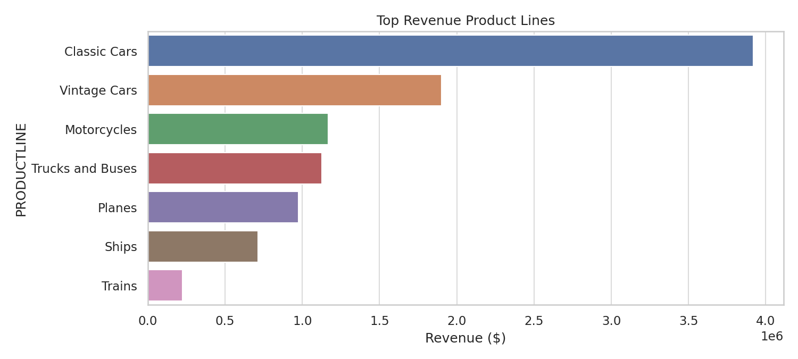
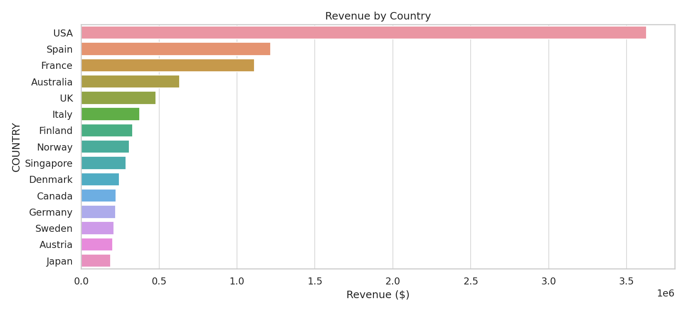
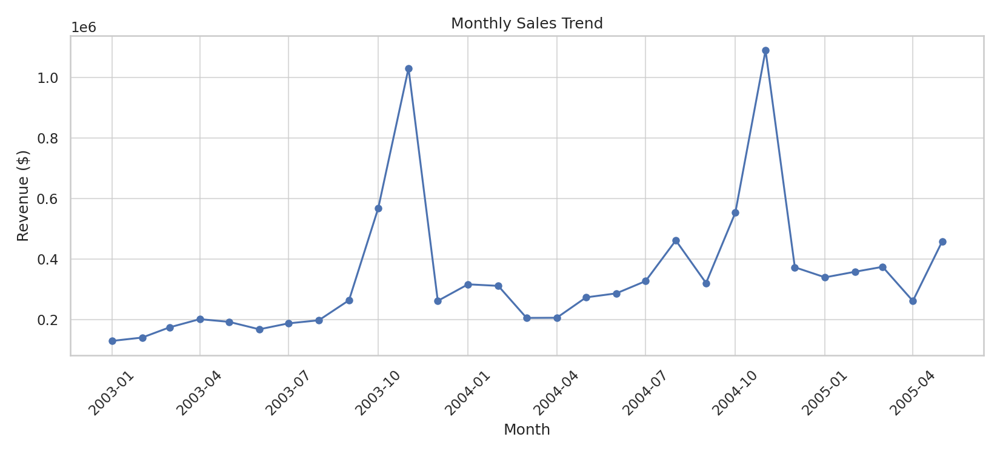

# 📊 Retail Sales Analytics Project

**Author:** Manne Hari Chandana  
**Role:** Aspiring Data Analyst  
**Tools Used:** Python | Pandas | NumPy | Matplotlib | Seaborn

---

## 🚀 Project Overview  
This project analyzes real-world retail sales data to uncover insights on revenue growth, customer distribution, product performance, and seasonal trends.  
It includes **data cleaning, visualization, KPI tracking**, and **business insights** for strategic decisions.

---

## 🧠 Objectives

✔ Clean raw data and handle missing values  
✔ Visualize revenue performance across regions and products  
✔ Identify top-selling categories and peak sales periods  
✔ Recommend actions to boost business growth

---

## 🏆 Key Business Insights

| Insight Category | Finding |
|-----------------|---------|
| 💸 Revenue Trend | Q4 drives maximum sales |
| 🌍 Top Market | USA contributes highest revenue |
| 🚘 Best Product Line | Classic Cars dominate sales |
| 🤝 Deal Size | Medium deals occur most frequently |
| 📅 Monthly Pattern | Holiday season shows sharp sales rise |

These insights empower better pricing and inventory strategies.

---

## 📂 Project Files

```
Retail-Sales-Analytics/
 ├─ 1_README.md
 ├─ 2_Retail_Sales_Analysis_Final.ipynb
 ├─ 3_cleaned_sales_data.csv
 ├─ 4_Corporate_Insights_Report.pdf
 └─ charts/
     ├─ product_chart.png
     ├─ country_chart.png
     └─ monthly_chart.png
```

✅ Easy to understand for recruiters  
✅ Shows complete workflow end-to-end

---

## 📈 Visual Insights

### 💰 Revenue by Product Line


### 🌍 Sales by Country


### 📅 Monthly Sales Trend


---

## 📘 Resources

📌 Full Code Notebook (Step-by-step):  
`2_Retail_Sales_Analysis_Final.ipynb`

📌 Cleaned Dataset:  
`3_cleaned_sales_data.csv`

📌 Business Insights Report:  
`4_Corporate_Insights_Report.pdf`

---

## 🧰 Skills Demonstrated

- Data wrangling & preprocessing  
- Exploratory Data Analysis (EDA)  
- KPI performance measurement  
- Business intelligence storytelling  
- Data-driven insights & recommendations  

---

## 🤝 Connect With Me

📌 LinkedIn  
🔗 https://www.linkedin.com/in/manne2805hari/

📧 Email  
📮 manneharichandan2805@gmail.com

---

⭐ If you find this project valuable, please give a **Star** to support my Data Analytics journey!
